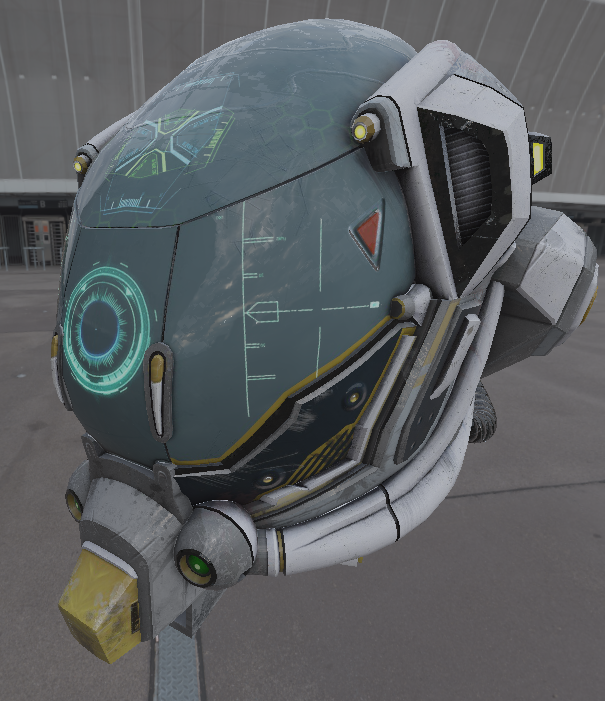

# VulkanRenderer
VulkanRenderer is a 3D renderer I am writing to experiment with graphics programming.



## How to build
Simply call ```cmake -B Build .``` from the root directory. This will automatically fetch dependencies. Once CMake has finished the generation phase, run ```cmake --build Build``` to build the project files from the command line.

## Project background
- C++23
- Vulkan 1.4
- Dependencies: GLFW3, GLM, VulkanMemoryAllocator, tinygltf, DearImGui, stb_image

## Features
- Physically-Based Shading pipeline
- Normal mapping
- Bindless textures (via VK_EXT_descriptor_indexing)

## References
- [SIGGRAPH 2013 Physically Based Shading Course Notes](https://blog.selfshadow.com/publications/s2013-shading-course/#course_content)
- [Khronos Vulkan Tutorial](https://docs.vulkan.org/tutorial/latest/00_Introduction.html)
- [LearnOpenGL](https://learnopengl.com/)
- [Cem Yuksel's Lectures](https://www.youtube.com/@cem_yuksel)