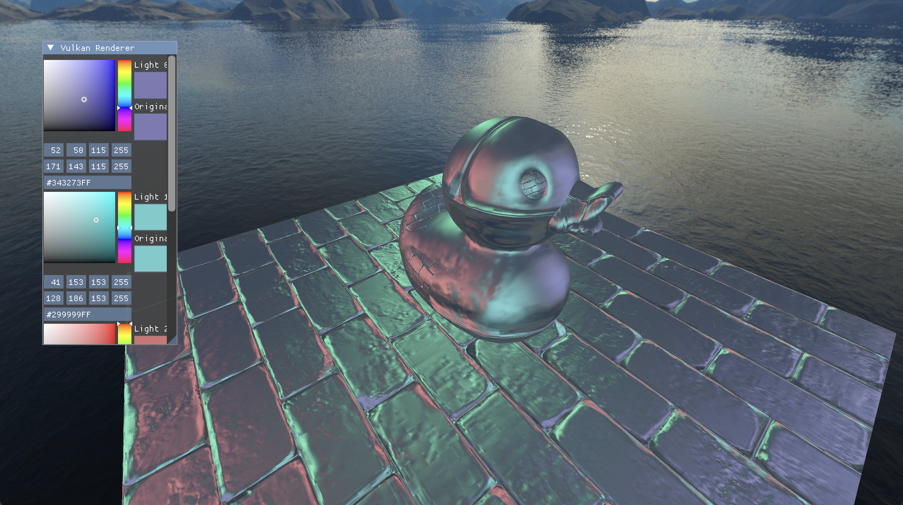

# VulkanRenderer
VulkanRenderer is a project for me to experiment with graphics programming.



## How to build
Simply call ```cmake -B Build .``` from the root directory. This will automatically fetch dependencies. Once CMake has finished the generation phase, run ```cmake --build Build``` to build the project files from the command line.

## Project background
- C++17
- Vulkan 1.4
- Dependencies: GLFW3, GLM, VulkanMemoryAllocator, tinygltf, DearImGui, ktx

## Features
- Blinn-Phong shading
- Normal mapping
- Bindless textures (via VK_EXT_descriptor_indexing)
- Directional shadow mapping
- Skybox
